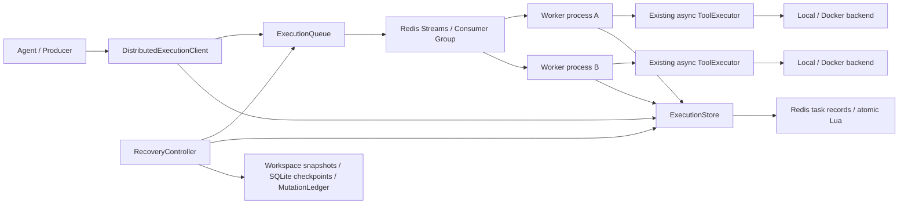
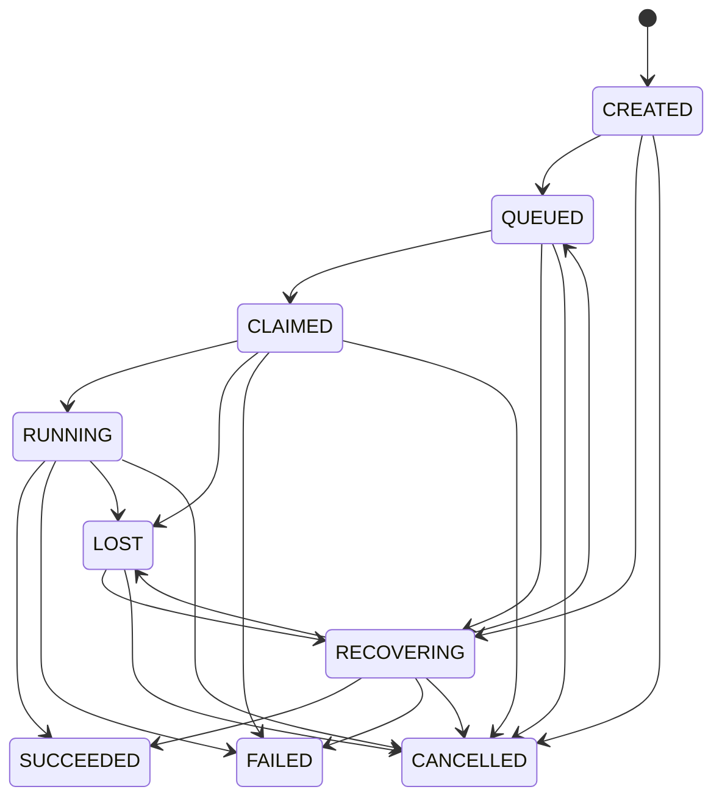

# Distributed Worker Runtime V1

Cortex keeps local execution as the default. This opt-in layer delivers logical
Tool executions through Redis Streams to **independent Python OS processes**.
Workers construct the existing ToolRegistry, async ToolExecutor, Local/Docker
backend and WorkspaceRecoveryRuntime in their own process. No AgentLoop rewrite
or Redis import in the Tool system is required.

Delivery is **at least once**, not exactly once. Correctness depends on trusted
Tool side-effect classifications and durable Redis configuration. Redis is the
coordinator, not a tool cache or a distributed transaction manager.

## Architecture and modules

| Module | Responsibility |
| --- | --- |
| `cortex/distributed/models.py` | Task, state transitions, errors and fenced lease |
| `interfaces.py` | ExecutionQueue, ExecutionStore, WorkerRegistry contracts |
| `redis_adapter.py` | Streams/group/PEL adapter, atomic Lua execution store, heartbeat registry |
| `client.py` | Explicit sync/async submission and terminal-result waiting |
| `worker.py` | Process identity, ToolExecutor invocation, renewal, result persistence and ACK |
| `recovery.py` | Pending reclaim, orphan repair, policy decisions, durable Workspace evidence |
| `factory.py` | Existing tools/backends and persistent SQLite/Shadow Git construction |
| `executor.py` | Explicit Agent-facing distributed dispatch for selected NONE tools |
| `__main__.py` | Worker, recovery controller, producer and status CLI |



Core Runtime code consumes interfaces. Only the Redis adapter and composition
root know keys or Redis APIs. Arguments, results, recovery payloads and filesystem generations are stored
as opaque JSON strings inside Lua-managed metadata: Redis cjson must not change
empty arrays into objects or round large user numbers. The adapter has bounded,
rotating Pending/task scans so live old entries do not starve newer stale tasks.

## State machine



`QUEUED -> FAILED` also handles exhausted claim budgets. SUCCEEDED, FAILED and
CANCELLED are immutable terminal states; cancellation is idempotent. Every
transition appends state/time/attempt/owner to task history. Attempts increment
only on Worker claim, not message publication or recovery reservation.

Task fields include execution/tool-call identity, arguments, policy, stable
idempotency key, state, attempt limit, worker owner, created/started/finished times,
lease expiry, durable result/error, recovery evidence and transition history.
Workspace tasks also bind root and filesystem generation. Redis Pending is a
**delivery status**, never a Cortex logical execution state.

## Streams, Pending and ACK

The producer persists CREATED, publishes a Stream message carrying execution_id,
then marks QUEUED. Success means these calls were acknowledged by Redis; it does
not mean the Tool succeeded. Connection/timeout errors raise
`InfrastructureUnavailable`, including cases where a timed-out command may have
been applied. Re-submit using the same idempotency key, never guess success.

Each namespace has one stream and a `workers` consumer group. Consumer names
contain a label, PID and random UUID. Workers use XREADGROUP and never ACK on
receipt. Terminal results are persisted before ACK. Business failures that are
eligible for another attempt enter LOST with a durable known outcome and remain
Pending while recovery decides safety; this is distinguishable from infrastructure
loss by the error/outcome fields.

Recovery uses XPENDING and exact-message XCLAIM (equivalent reclaim rather than
XAUTOCLAIM). A safe retry reserves execution ownership, publishes a replacement,
makes QUEUED and only then ACKs the old message. A crash in this handoff may create
duplicates; it cannot intentionally ACK the sole recoverable delivery first.
CREATED/QUEUED orphan repair handles producer/publish gaps. Unknown execution IDs
are corruption errors and remain Pending rather than being silently dropped.
No Stream trimming, task eviction, manual key deletion or consumer-group deletion
is supported while executions exist.

## Ownership, lease and heartbeat

Acquisition, renewal, start, result persistence, loss and recovery reservation run
atomically in Redis Lua using **Redis server time**. Leases match execution ID,
owner, attempt and a monotonically increasing lease token. The extra token fences
old reservations even when a controller identity and attempt are reused.
Expired owners cannot renew, start, finish or release a newer owner's task.
Recovery controllers also reserve a lease; there is no non-atomic read/write lock.

Heartbeat stores PID/host and a periodically updated heartbeat time with TTL.
It is separate from execution lease renewal. Missing heartbeat alone cannot revoke
a valid execution lease. Pending idle alone cannot revoke one either. A live
heartbeat does not make an expired execution lease valid.

Workers renew while executing and stop/cancel their invocation if renewal fails
or ownership is lost. They leave the message Pending. A SQLite/Git completion
commit running in a thread is shielded and joined before cancellation cleanup so
it cannot race a second boundary commit. Shutdown stops new claims and finishes
an owned task; force-kill uses recovery. Expired heartbeat identities stop claiming
and are replaced by a fresh process identity on restart.

A fencing token protects **store mutations**, not arbitrary external effects.
An orphan child/container may survive a hard Worker kill. Therefore a reversible
pre-snapshot alone is never enough to automatically replay a running mutation.
Existing workspace file locks serialize cooperating processes; host editors and
external services do not participate in those locks.

## Idempotency

A stable key atomically maps to one canonical execution ID. Reusing it with a
changed tool, arguments, policy, attempt limit or workspace binding raises an
idempotency conflict. Use a fresh key for a genuinely new logical operation.

* A message duplicate is another Stream entry for the same execution.
* An execution duplicate is another submission with the same stable key.
* A side-effect duplicate is the underlying Tool doing its effect twice.

Terminal SUCCEEDED results are reused without invoking the Tool, including crash
between result persistence and ACK. FAILED/CANCELLED duplicates are also terminal
and ACKed. Atomic ownership prevents concurrent ordinary invocations of one task.
If an effect completed before any durable success evidence existed, its outcome
can remain uncertain. The key cannot close this window or deliver exactly once.

## Retry policy and Workspace recovery

Workers verify producer policy against the trusted registry. Policy mismatch,
unknown Tool, invalid arguments and permission failure never invoke/retry the
Tool. Error classification separates WORKER_CRASH, LEASE_EXPIRED, TOOL_TIMEOUT,
TOOL_EXECUTION_ERROR, TOOL_INFRASTRUCTURE, INVALID_ARGUMENTS, PERMISSION_FAILURE, POLICY_MISMATCH,
RETRY_EXHAUSTED, SIDE_EFFECT_UNCERTAIN, RECOVERY_CONFLICT and RESULT_SERIALIZATION.
A retry-budget failure retains the last Tool error in result metadata.

| Existing SideEffectPolicy | Running crash / expired lease |
| --- | --- |
| NONE | May retry up to max_attempts; effect-free classification must be truthful |
| WORKSPACE_REVERSIBLE | Only replay after positive durable completion evidence and verified selective rollback |
| COMPENSATABLE | Uncertainty becomes FAILED; interface/classification retained, no compensation workflow |
| IRREVERSIBLE | Uncertainty becomes FAILED; never unconditional automatic replay |

CLAIMED tasks that never entered RUNNING can retry under any policy: the Runtime
has not called the Tool. RUNNING is recorded before invocation, so a crash in the
small RUNNING-to-call window is conservatively uncertain for side-effecting tools.

For workspace tools an optional generic ToolExecutionContext hook persists the
actual pre-checkpoint/action identity under the existing workspace ownership,
before Tool invocation. Workers capture the result as an Observation and commit
an existing ExecutionCheckpoint + MutationLedger before Redis success. A restarted
controller checks root/generation, optional WorkspaceSession guard, durable branch
head, completion reason and matching action ID. A successful completed checkpoint
can restore the result into Redis without replay. A known failed completed action
uses **rollback_action**, with before/after blobs, modes and current-state conflict
checks, before another attempt. An optional generic before_restore callback
revalidates the recovery lease inside the existing workspace lock before the
restore and before each file write, preventing a stale lock waiter from restoring.
Distributed workspace actions fingerprint excluded Git/runtime metadata even in
Direct mode; changed metadata is explicitly unrecoverable, never replayed or
represented as an invertible Ledger operation. Ordinary local Direct mode remains
unchanged. User edits, subsequent same-path actions, stale
roots and unsupported/excluded mutations fail closed.

No durable completion evidence means no automatic full snapshot restoration and
no replay. This intentionally sacrifices availability for protection from orphan
writers and user-change loss. If a controller crashes during/after selective
compensation before Redis handoff, the changed history head is not treated as a
fresh completed Tool: subsequent recovery fails closed for manual inspection.
Existing full Workspace rollback and audit checkpoints remain available.

The Worker sets ToolExecutor.max_retries to zero: one supervised Tool attempt per
distributed attempt. ToolExecutor still owns argument validation, permissions,
backend execution, timeout and cancellation. Its child entry point is static, so
spawn serializes only the Tool/input rather than executor locks or SQLite handles. Distributed recovery owns cross-
process retries and bounds them with max_attempts. Tool business retry honors
`tool.retryable`; crash replay follows side-effect safety. Serialization errors
are terminal because another invocation cannot repair the transport contract.

## Opt-in usage and Agent compatibility

Use `DistributedExecutionClient.submit/asubmit` and `wait` for explicit tasks.
For workspace tasks set absolute workspace_root and `[st_dev, st_ino]` generation;
the CLI derives these from `--workspace`. All workers/controllers in a namespace
must share the trusted registry, execution root, backend policy and durable storage.

`build_agent(..., distributed_execution_client=client,
distributed_tool_names={'slow_tool', 'read_note', 'list_notes'})` uses the existing
async wave scheduler through a ToolExecutor subclass. Only explicitly named NONE
tools are routed; permissions/validation are checked by both caller and Worker.
Sync execution outside an event loop also works. Other tools retain their existing
local logical/physical mutation boundaries. A stable Agent session/action key
allows result reuse when the caller resumes waiting.

**V1 Agent facade boundary:** workspace-mutating tools use explicit ExecutionTask
submission rather than the Agent facade. Remote mutations have Worker-owned
durable logical checkpoints. V1 does not fabricate an Agent-held MutationBoundary
across process/network waits or rewrite AgentLoop to reconcile remote Agent state.
Observer timeout/cancellation does not imply remote execution cancellation.
Explicit store cancellation fences an active owner and renewal triggers best-effort
invocation cancellation; CANCELLED does not undo already produced side effects.

For an existing isolated WorkspaceSession, Worker construction requires
`--workspace-session-id ID --workspace-manager-root PATH` and the actual
`--workspace EXECUTION_ROOT`. It reuses session validation and binds both Tool and
backend to execution_root; session mode selects the existing Local sandbox/Docker
isolation. `--isolated` without a durable session is rejected. Storage must be
outside execution_root and isolated main_root. The layer never applies a session
or mounts main_root; Apply/Discard remain explicit WorkspaceManager operations.
Stop related Worker processes before Apply/Discard. Existing workspace locks and
session guards serialize/reject stale execution, and isolated Local still requires
bubblewrap; Windows uses the existing Docker isolation path.

## Local Redis and two processes (Windows PowerShell / Linux)

Install dependencies in your active virtualenv: `python -m pip install -r requirements.txt`.
Redis 7 on Docker Desktop is sufficient; no remote servers are needed. Use AOF
and a persistent volume for restart durability:

```powershell
docker volume create cortex-redis-data
docker run -d --name cortex-redis -p 127.0.0.1:6379:6379 -v cortex-redis-data:/data redis:7-alpine redis-server --appendonly yes --appendfsync always
```

Create a workspace and storage **outside it**, then run each Worker in a different
terminal from the repository, using the same Python virtualenv:

```powershell
New-Item -ItemType Directory -Force .\work\execution | Out-Null
# Terminal A
python -m cortex.distributed worker --worker-name A --workspace .\work\execution --storage .\work\worker-state
# Terminal B
python -m cortex.distributed worker --worker-name B --workspace .\work\execution --storage .\work\worker-state
# Optional independent controller; workers also run recovery themselves
python -m cortex.distributed recovery --workspace .\work\execution --storage .\work\worker-state
```

Producer in another terminal (arguments-file avoids native JSON quoting differences
between Windows PowerShell 5.1 and PowerShell 7):

```powershell
'{"seconds":1}' | Set-Content -Encoding UTF8 .\work\task.json
python -m cortex.distributed submit --tool-name slow_tool --tool-call-id demo-1 --arguments-file .\work\task.json --workspace .\work\execution
python -m cortex.distributed submit --tool-name slow_tool --tool-call-id demo-2 --arguments-file .\work\task.json --workspace .\work\execution
python -m cortex.distributed status --execution-id ID_FROM_SUBMIT
```

On Linux use `mkdir -p work/execution`, forward-slash paths and the same Python
commands. `--backend docker` selects the existing Docker backend/image rather than
introducing a new backend. `--factory module:function` is trusted process-local
composition for custom registries, not remote code import from task arguments.
`CORTEX_REDIS_URL`, `--redis-url` and `--namespace` configure coordination explicitly.

## Integration tests

```powershell
$env:CORTEX_TEST_REDIS_URL = 'redis://localhost:6379/15'
python -m pytest -q tests/test_distributed_runtime.py tests/test_distributed_redis_integration.py
python -m pytest -q
python eval/smoke_eval.py
```

Linux: `CORTEX_TEST_REDIS_URL=redis://localhost:6379/15 python -m pytest -q`.
For existing Docker backend integration, also set `CORTEX_RUN_DOCKER_TESTS=1` and
build `cortex-execution-runtime:v1` using the existing execution-runtime guide.
Tests create UUID namespaces and delete only their keys; they never FLUSHDB.
Do not share a test Redis with unrelated workloads: outage tests deliberately
pause the real server briefly. Missing default Redis is an explicitly reported
external-dependency skip; an explicitly configured but unavailable server is a
**test failure**. CI provisions Redis and runs these tests instead of skipping.

Tests use multiprocessing **spawn**, real Redis and process.kill(), including
normal parallel execution, private per-process counters, running crashes,
completion-before-ACK crashes, duplicate messages/submissions, concurrent ownership
and reclaim, lease/heartbeat separation, actual invocation cancellation on lease
loss, workspace rollback/conflict/evidence, retry budgets, cancellation, JSON
round-trip, real server pause, PowerShell UTF-8 BOM arguments files, default Worker CLI/
ToolExecutor spawn execution and a real isolated Docker Worker preserving main_root.

## Failure windows

| Window | V1 behavior |
| --- | --- |
| Received message, before execution | UnACKed PEL retained. QUEUED/CLAIMED is safe to recover after ownership expiry; RUNNING-before-call is conservative uncertainty for side effects |
| Tool running, Worker crashes | Heartbeat expires separately; only expired execution lease permits LOST/RECOVERING. NONE can replay; workspace/external effects need positive safe evidence or fail closed |
| Tool succeeded, result not persisted | NONE can execute again. A completed workspace SQLite checkpoint recovers result; without it workspace/irreversible/compensatable fail closed |
| Result persisted, before ACK | Reclaim reads terminal result, never calls Tool, ACKs duplicate delivery |
| ACK complete, Worker crashes | Terminal result remains authoritative; subsequent execution/message duplicates reuse it |
| Redis temporarily unavailable | Explicit infrastructure failure; delivery/result durability may be unknown. Renewal failure cancels invocation, no fabricated success, stable-key resubmission/recovery handles uncertain commands |
| Heartbeat alive, lease expired | Old lease is fenced; state may become LOST even though process is alive. Old process cannot publish a terminal result; no blind replay of uncertain side effects |
| Concurrent reclaim attempts | Atomic execution reservation + fenced token chooses an owner. Message ownership alone is insufficient; racing controllers may generate duplicates but not valid simultaneous logical ownership |

## Known limitations and extension points

* One machine/shared filesystem, Redis standalone; no Redis HA/Cluster/Sentinel,
  distributed lease service, Kubernetes, leader election or autoscaling.
* AOF/volume persistence is an operator responsibility. Redis loss, eviction or
  manual state deletion can invalidate deduplication; V1 cannot guarantee recovery
  across loss of the coordinator's durable data. Atomic Lua writes are not a
  transaction with Git/SQLite, Redis ACK or arbitrary external effects.
* SideEffectPolicy and backend supervision must be truthful. Local shell policy
  does not turn unrestricted host execution into a sandbox. Worker fencing cannot
  terminate every orphan child/container after process.kill(); uncertain workspace
  mutations are deliberately not replayed. There is no external compensation flow.
* Timing uses Redis wall clock; large clock jumps, oversized blocking snapshots or
  long recovery operations can lose a lease. Store writes are fenced and recovery
  is conservative, but this does not make physical effects transactional.
* Worker runs one owned logical task at a time; existing async ToolExecutor remains
  the execution/supervision engine. No resource scheduling, priorities, DAG, tenant
  controls, distributed Agent state or Sub-agent routing are introduced.
* History and idempotency records have no automatic retention/GC in V1. Task scans
  rotate fairly but currently read an index of all retained executions; scale and
  observability improvements can be added behind the interfaces.
* Native Windows execution needs Bash for Bash-dependent tools or Docker Desktop;
  this version does not substitute cmd/PowerShell for Bash. Linux integration
  execution does not constitute native Windows certification.

Remote transport/store adapters can implement the existing interfaces. Future
remote workers need explicit workspace provisioning/generation, result/artifact
transport and physical-effect fencing rather than sharing local paths. Kubernetes
could supervise Worker processes without changing AgentLoop, but requires separate
resource/ownership lifecycle, deployment and shutdown design; V1 makes no claims
about these deployments.

## Verified delivery

Verified on Linux / Python 3.12 with real Redis 7 (Docker, AOF enabled), independent
spawned Python workers, and the existing `cortex-execution-runtime:v1` Docker image:

```bash
CORTEX_TEST_REDIS_URL=redis://localhost:6380/15 CORTEX_RUN_DOCKER_TESTS=1 python -m pytest -q -rs
# 239 passed, 1 skipped; no resource-cleanup warnings
python eval/smoke_eval.py
# EVAL GATE: PASSED
```

The single skip is `tests/test_workspace_runtime_v2.py:353`, which requires a
native Windows filesystem / Git Bash. Redis and Docker integration tests were
actually executed; native Windows execution was not available and is not claimed.
